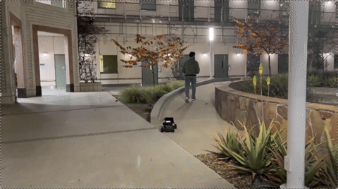

<h1 align="center">Autonomous Roadside Mechanic</h1>
 

  

## 

<h3>Team 12 </h3>
<h3>ECE/MAE 148 Final Project FA25</h3>

## Table of Contents
  <ol>
    <li><a href="#team-members">Team Members</a></li>
    <li><a href="#overview">Overview</a></li>
    <li><a href="#what-we-promised">What We Promised</a></li>
    <li><a href="#accomplishments">Accomplishments</a></li>
    <li><a href="#demonstration">Demonstration</a></li>
    <li><a href="#challenges">Challenges</a></li>
    <li><a href="#robot-design">Robot Design</a></li>
    <li><a href="#electrical-diagram">Electrical Diagram</a></li>
    <li><a href="#references">References</a></li>
    <li><a href="#Acknowledgments">Acknowledgments</a></li>
  </ol>
  
## Team Members

<ul>
  <li>Edward Wang - Electrical Computer Engineering</li>
  <li>Tauhid Arif Malik - Computer Science and Engineering</li>
  <li>Yutong Wang - Mechanical and Aerospace Engineering</li>
  <li>Ashton Lao - Mechanical and Aerospace Engineering</li>
</ul>

## Overview
Build an autonomous, vision-driven robot that can search for a person, approach them safely, avoid obstacles, and interact through real-time gesture-based games (approach, stay, follow, play) using an OAK-D depth camera. The system is developed in structured phases for robust testing, safety, and repeatable evaluation.

## What We Promised
### Must Have:
* OAK-D depth camera
* DonkeyCar + Raspberry Pi 5
* PyTorch / TensorFlow Lite
* OpenCV
* DepthAI SDK
* Monitor
* Interaction games model

### Nice to Have:
* Mic - Voice interaction
* Speaker - Sound feedback
* GPS navigation
* LIDAR

## Accomplishments
* Successfully implemented real-time human detection using the OAK-D Lite camera and the DepthAI API.

* Developed a person-following system that computes bounding box center offsets and depth information to control vehicle motion.

* Achieved smooth and stable tracking performance, allowing the robot to continuously follow a moving person.

* Enabled accurate distance estimation using depth sensing to maintain a safe and consistent following distance.

* Integrated real-time camera visualization with overlay UI, displaying bounding boxes, distance metrics, and system status.

* Implemented a gesture-based mini-game (Rock–Paper–Scissors) using MediaPipe and DepthAI for hand detection.

* Built a gaming UI interface displayed on an external monitor, providing visual feedback during human–robot interaction.

* Verified real-time system performance on Raspberry Pi, including perception, UI rendering, and control updates.

* Demonstrated a complete pipeline from visual perception → motion control → human interaction on a mobile robot platform.

## Demonstration

[Watch Full Demo Video](https://drive.google.com/file/d/1NvWGRfAZQcVBCm_B-qczKjxjoUKfPYbd/view?resourcekey)

## Challenges
* Camera instability occurred when running person-following code with an external monitor connected.

* Person-following performance degraded or stopped during sharp turns or rapid motion.

* The 3D-printed monitor mount was mechanically fragile and prone to breaking.

* Limited power delivery from the Raspberry Pi caused system instability under high load.

* Power fluctuations occurred when the monitor drew additional current, leading to camera dropouts.

* Detection accuracy was sensitive to lighting conditions in the environment.

* The OAK-D camera’s narrow field of view (69°) reduced robustness during lateral motion.

* Mechanical design limitations, including insufficient sideways force support and suboptimal print orientation, reduced structural durability.

 
## Robot Design

### Hardware Components list
  * Traxxas Chassis with steering servo and sensored brushless DC motor
  * Raspberry pi
  * OAK-D camera
  * Lidar LD06
  * 12V Battery
  * DC-DC Converter (12V to 5V)
  * VESC
  * 7-inch monitor

## Electrical Diagram

 
## References
* [OAKD Camera Model](https://github.com/Edwardwang66/OAKD_camera_project)

## Acknowledgments
Documentation inspired by/directly referenced from Team 5 - Fall 2024

Thank you to Professor Jack Silberman and our incredible TA's Winston and Aryan for an amazing Fall 2025 class!

